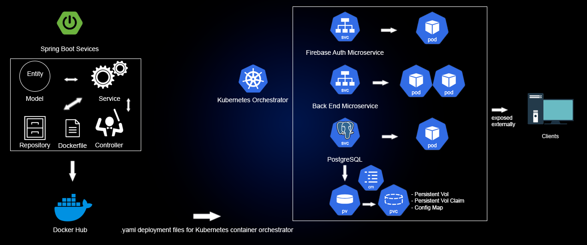

# <h2 align="center">BTH-Assignment-Build-Something-Paul-Kakarantzas</h1>

 
## Software General Concept 

The software I have implemented is a dynamic and innovative platform, currently in its initial stages of development, which draws inspiration from successful online food delivery services.
It serves as a location-based 'marketplace' for health and wellness services, including hair salons, massage centers, and pet grooming stores. Users can effortlessly book appointments through
their smartphones, select their preferred service providers, and provide valuable feedback through reviews. On the other side, business owners can seamlessly manage their appointments, whether
they are manually booked or through our platform, and gain valuable insights through analytical tools. The software architecture comprises two microservices and a PostgreSQL database deployed
in Kubernetes. The first microservice named FirebaseAuthMS, focuses on secure authentication using Google's Firebase, offering user registration, token generation, and token refreshing. 
The second microservice named OneBEServiceMS, facilitates the creation of store administrators within the database and retrieves a comprehensive list of them. To ensure data persistence, 
the PostgreSQL database is deployed in Kubernetes with a persistent volume, safeguarding data integrity even after the system restarts.
 